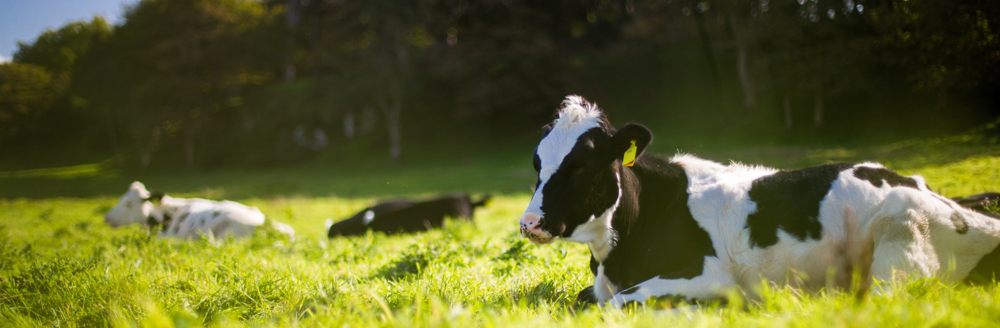

# 🥛 Ganga Dairy – OctaNet Internship Project

This is a responsive **landing page** built for **Ganga Dairy** as part of the **OctaNet Internship**. The page showcases dairy products like milk, paneer, ghee, and yogurt in a clean and visually appealing layout. It serves as a front-end representation for a brand’s online identity.

---

## 📸 Preview



---

## 🎯 Objective

The goal of this project was to:

- Build a fully responsive dairy business landing page using only **HTML** and **CSS**.
- Implement core web design principles including branding, layout design, and visual hierarchy.
- Practice real-world web development tasks expected in internships or freelancing.

---

## ✨ Features

- 🧈 Showcases products like Milk, Paneer, Ghee, Yoghurt  
- 🎨 Appealing UI with dairy-themed colors and illustrations  
- 📱 Mobile-friendly and responsive layout  
- 🖼️ Uses dairy product images for better visualization  
- 🌐 Can be used as a homepage or hero section for a dairy business

---

## 🛠️ Built With

- HTML5  
- CSS3  
- Responsive Design Techniques  
- Flexbox & Grid

---

## 📂 Project Structure

OctaNet_Internship/
│
├── index.html # Main HTML file
├── style.css # Styling and layout
├── logo.jpg # Brand logo
├── milk.jpg # Milk product image
├── cheese.png # Paneer product image
├── ghee.jpg # Ghee product image
├── yoghurt.png # Yogurt product image
├── background.png # Background image used in design
├── Paner.jpg # Additional paneer image
├── README.md # This file

yaml
Copy
Edit

---

## 🚀 How to Run Locally

1. **Clone the repository**
```bash
git clone https://github.com/Rushi-Unge/OctaNet_Internship.git
Navigate into the folder

bash
Copy
Edit
cd OctaNet_Internship
Open the file

Simply open index.html in your browser.

Or use Live Server extension if you're using VS Code for better development experience.

📌 Use Case
This type of landing page can be used for:

Dairy product marketing websites

E-commerce dairy product front-ends

Restaurant or cafe promotional pages

Food startup product showcase

📈 Future Enhancements
 Add a navbar for easier navigation

 Include a contact form or order button

 Add animations on scroll

 Integrate a product purchase or inquiry system

👨‍💻 Author
Rushikesh Unge
📧 Email: rushikeshungeofficial@gmail.com
🔗 GitHub: Rushi-Unge
🔗 LinkedIn: linkedin.com/in/rushiunge

📃 License
This project is open source and available under the MIT License.

yaml
Copy
Edit

---

Let me know if you want to **add animations**, **SEO tags**, or convert this into a **React version** in the future!
